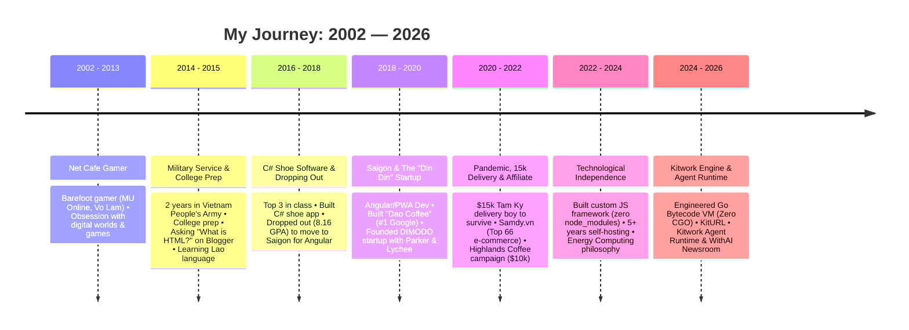

# Hi, I'm Huỳnh Nhân Quốc (Q) 👋

> **📍 Tam Ky ↔ Da Nang, Vietnam** | 🚀 **Indie Engineer & Solo Founder** | 🧠 **Go VM Architect & Systems Developer**  
> *"Some people work for money. Some people work for passion. I work for **HAPPINESS**."*

---

## 🌟 Overview & Identity

Hi there! I am **Huỳnh Nhân Quốc** (often known as **Q**). I am a self-taught independent engineer (Indie Engineer), creator, and author of **[Kitwork Engine](https://kitwork.io/)** — a sovereign multi-tenant logic engine and custom bytecode virtual machine (VM) built entirely in Go.

If someone asks me what my title is, I call myself a **"Multipotentialite"** (or in Vietnamese, *"Kẻ lông bông"*). I am a craftsman who builds digital systems from the bare ground: writing custom Go virtual machines, crafting zero-dependency vanilla JavaScript runtimes, administering raw Ubuntu servers, designing UI/UX, mastering search engine algorithms (SEO/GEO), and publishing open reflections.

> *"As long as these hands stay clean, I will take on any honest challenge."*

---

## 📚 The Complete 24-Year Life & Engineering Narrative (2002 — 2026)

---

### 🎮 Chapter 1: Childhood, Internet & Gaming Cafes (2002 – 2013)
In 2002, as the Internet was introduced across Vietnam, my journey began in local gaming cafes in my hometown of Tam Ky.
- My childhood revolved around games like *MU Online*, *Yahoo Messenger*, *Võ Lâm Truyền Kỳ*, *Space Cowboy*, and *Perfect World*.
- It was a childhood of climbing fences, walking barefoot to net cafes, and enduring strict discipline and beatings with switches from my parents for escaping home to play.
- In real life, I was an ordinary, anonymous kid. But inside the game, I was a dedicated hero grinding through levels. That experience taught me persistence, grit, and an unquenchable curiosity for technology.

---

### 🪖 Chapter 2: Military Service, College & Learning Lao (2014 – 2015)
- **January 30, 2014**: Enlisted in the Vietnam People's Army for 2 years of mandatory military service. Celebrating my first Lunar New Year away from home in uniform, I wrote a poem for my parents:
  > *"Con nhớ bạn bè và cả gia đình / Như cách chim đang ở trời xa / Xuân sang ai muốn xa nhà / Là con đâu muốn xa rời mẹ cha / Nhưng vì nghĩa vụ mẹ à / Khi xuân còn thắm, phải xa đôi đường..."*  
  Serving my country remains one of my proudest early achievements.
- **February 2015**: Discharged and returned home to Tam Ky. I helped my family, earned my driver's license, prepared for university entrance exams, and discovered Blogger (Google).
- **September 2015**: Admitted to Quang Nam University majoring in IT. The very first search query I ever typed online was: *"What is HTML?"*. I taught myself HTML, CSS, and JavaScript to customize Blogger themes.
- **Marx-Leninism & Philosophy**: While many students disliked philosophy, I developed a passion for it, taking notes and finding a scientific worldview to converse with others.
- **Paper Exams & Recursion**: When faced with a C/C++ paper exam, I copied recursive function code from memory onto paper—marking the first and last time I ever copied code.
- **Learning Lao Language**: My class included 11 international students from Laos. Intrigued by their Vietnamese fluency, I taught myself conversational Lao online, memorized their names, and told jokes in Lao by mapping Vietnamese words to Lao syntax.

---

### 💻 Chapter 3: C# Shoe Software & The Choice to Drop Out (2016 – 2018)
- **Year 2 of University**: I fell deeply in love with C#. Over 3 intense months, I built a shoe store management desktop application using WinForms.
  * Converted VB.net code snippets into C# using online conversion tools.
  * Created custom color IDs using Hashtables (e.g., `00` for white, `11` for black, `01` for white-black, `22` for red).
  * Implemented fallback try-catch loops for auto-incrementing ID indexing when array lengths mismatched deleted items.
  * Inspired by barcode scanners at my local Tam Ky supermarket, I researched and integrated Code128 barcode generation.
- I leaped into the **Top 3 of my class**, scoring near-perfect grades in C# and SQL.
- I went on to explore WPF, MVVM, Entity Framework, LINQ, Xamarin, Firebase Realtime Database (streaming Google Sheets JSON), Azure, Ionic, Cordova, and Progressive Web Apps (PWA).
- **The First Job Application Letter**:
  * Built a PWA pizza store app (`https://pizza-box88.firebaseapp.com/`) using Angular, Firebase, Bootstrap, and Material Design.
  * Despite **ranking 5th out of 46 students with an 8.16 GPA** and earning 3+ million VND/month working part-time, I realized school could not take me where I wanted to go.
  * I dropped out of university and quit my job to move to Saigon:
    > *"If I do what I am passionate about, then it isn't work."*

---

### 🚀 Chapter 4: Saigon Engineering, "Dao Coffee" & The "Din Din" Startup (2018 – 2020)
- Worked as an Angular developer in Saigon. Days spent shipping code, nights spent reading others' code to level up.
- **The SEO Breakthrough**: Built websites that ranked #1 on Google (including *Dao Coffee*). I dove deep into Google Bot mechanics, Server-side Rendering (SSR), Angular Ivy compiler, PWA, TWA (Trusted Web Activity for Google Play), and JAMstack (Jekyll, Hugo, GatsbyJS, Next.js, Nuxt.js).
- **April 19, 2019 Essay**: Reflected on youth, persistence, having no mentors or guides—just following my heart and moving forward.
- **The "Din Din" Startup (DIMODO)**: In 2019, I met Parker (from South Korea) and Lychee (from Wuhan, China). Speaking poor English, we communicated using Google Translate ("What are you doing? Pồ rô gờ rem") and formed a 3-person startup team called "Din Din" (Chinese for monkey/tinh tinh). We debated Agile vs. MVP vs. Platform philosophy:
  > *"A product may fail, but a great platform will build even better products."*
- When the COVID-19 pandemic broke out in early 2020, Lychee returned to Wuhan, Parker returned home, and closed borders separated our team.

---

### 🛵 Chapter 5: Pandemic, $15k Tam Kỳ Delivery & $10,000 Affiliate Marketing (2020 – 2022)
- **Returning Home Broke (2020)**: With little money left, I started a local errand service called *"Giao vặt Tam Kỳ 15k"* (15,000 VND delivery service) to survive. As long as my hands stayed clean, no job was too small.
- **Insomniac Engineering**: I pulled all-nighters 200 out of 365 days (sleeping 10 PM to 3 AM or 9 AM sleep cycles).
- **Platform Milestones**: Solved 4 core architectural challenges (DNS Resolution, Root Pointers, Diamond Problem, Architecturalized Templates), built 10 websites, wrote 25 personal essays, and authored a novella.
- **Custom Vanilla JS Framework**: Built a framework from scratch using Web Components, OOP in JS, custom routers, template rendering, and lazy loading—with **zero `node_modules` dependencies**.
- **Samdy.vn & E-Commerce Success**: Built *Samdy.vn*, a price-comparison site that climbed into the **Top 66 largest e-commerce sites in Vietnam** in 2021 ($1,000 revenue in 2021 before Google algorithm update).
- **Highlands Coffee Campaign**: Built a viral traffic funnel combining paid ads and a 30,000-member Facebook community (*Kit Voucher*), generating **over $10,000 (200,000,000 VND)** in 6 months in 2022.

---

### ⚙️ Chapter 6: The Dream of "Technological Independence" & Go VM (2022 – 2024)

> *"Go outside while it is still daylight."*

After spending 27 hours straight in front of a small monitor, sacrificing sleep and health, I realized that true success is not empty titles (CEO/CTO) or endless hustle. It is **Technological Independence (Độc lập công nghệ)** and **Happiness**.

> *"Thương gì một kẻ lông bông / Trong tay kẻ đó lại không có gì / Mơ gì đâu chuyện ngày mai / Tương lai chẳng có, mưu cầu lại không."*

- **Self-Hosting Mastery**: Spent over 5 years self-hosting on raw Ubuntu VPS servers, mastering Go backend systems, request speed, and goroutine concurrency.
- **Energy Computing Philosophy**: Treating every memory allocation, context switch, and syscall as a unit of energy with a real cost. Focused on zero-allocation patterns on hot execution paths.
- **Engineering Kitwork Engine (2024–2026)**:
  * **Custom Stack-based Bytecode VM in Pure Go**: Built around the philosophy *"One binary. Many isolated systems."* Zero CGO, ~14MB binary, near-instant startup.
  * **24-Byte Value System**: Memory-optimized NaN-boxed tagged union struct.
  * **JS Subset & Gas Limits**: Arrow-only functions, no `while` loops, no `try-catch`, with opcode energy gas limits (`MaxEnergy`).
  * **KitURL & Agent Runtime**: Shipped KitURL and built **Kitwork Agent Runtime** (durable multi-tenant AI Agent execution with SQLite state, Skill contracts, and Human Approval Checkpoints powering WithAI Newsroom).

---

## 🧩 Architectural Concepts Learned By Hand

In building Kitwork and my own systems over the past decade, I mastered each of these core concepts by hand:

`runtime` · `host` · `native` · `tenant` · `lexer` · `ast` · `compiler` · `bytecode` · `opcode` · `vm` · `expression` · `evaluate` · `scope` · `capability` · `grant` · `sandbox` · `isolation` · `servertruth` · `zerovm` · `capsule` · `gas` · `router` · `render` · `template` · `prewarm` · `directive` · `behavior` · `hydrate` · `jit` · `blueprint`

---

## ⚙️ Core Projects

- ⚙️ **[Kitwork Engine](https://kitwork.io/)**: Sovereign multi-tenant Go logic engine & custom bytecode VM runtime.
- 🤖 **[Kitwork Agent Runtime](https://kitwork.io/agents)**: One binary, many isolated, durable AI agents with human approval checkpoints.
- 📰 **[WithAI.vn](https://withai.vn/)**: AI news platform powered by WithAI Newsroom Agents.
- 🔗 **[KitURL](https://kiturl.localhost)**: High-performance URL shortener running on Kitwork Engine.
- 🔎 **[seoer.ai](https://seoer.ai/)**: Generative Engine Optimization (GEO) & AI search specification.
- 🚀 **[theinpublic.com](https://theinpublic.com/)**: Build in Public & open startup knowledge hub.
- 🎧 **[lofiwithme.com](https://lofiwithme.com/)**: Ambient focus & lofi workspace.
- 🏠 **[huynhnhanquoc.com](https://huynhnhanquoc.com/)**: Personal portal, Substack writing & Digital Garden.

---

## 💡 Engineering & Personal Philosophy

> *"Some people work for money.*  
> *Some people work for passion.*  
> *I work for **HAPPINESS**."*

- **Technological Sovereignty**: Writing custom VMs, managing raw servers, and crafting tools to retain freedom in every choice.
- **Clean Hands**: *"As long as these hands stay clean, I will take on any honest challenge."*
- **Energy Computing**: Memory allocation is energy; optimize the hot path to zero allocations.

---

## 📖 Digital Garden & Open Writing

All my research, reflection, and engineering notes are open-sourced in **[publics/huynhnhanquoc](https://github.com/huynhnhanquoc/huynhnhanquoc)**:

* 📄 **[65 Substack Articles (2020 – 2026)](blog/)**: Full archive of writings covering indie hacking, Go VM engineering, self-hosting, and personal philosophy.
* 📄 **[49 Kitwork Architecture Reports (kitwork/)](kitwork/)**: Deep technical reports on Bytecode VM design, Memory Allocation, Gas Accounting, DX, and Agent Runtime.
* 📄 **[Thinking & Concepts (concepts/ & thinking/)](concepts/)**: Architectural notes and system designs.

---

## 🌐 Connect with Me

- 📧 **Email**: [hi@huynhnhanquoc.com](mailto:hi@huynhnhanquoc.com)
- 🌐 **Website**: [huynhnhanquoc.com](https://huynhnhanquoc.com)
- 💻 **GitHub**: [@huynhnhanquoc](https://github.com/huynhnhanquoc)
- 🐦 **X (Twitter)**: [@huynhnhanquoc](https://x.com/huynhnhanquoc)
- 🧵 **Threads**: [@huynhnhanquoc](https://threads.com/@huynhnhanquoc)
- 📰 **Substack**: [huynhnhanquoc.substack.com](https://huynhnhanquoc.substack.com)
- 📺 **YouTube**: [@huynhnhanquoc](https://www.youtube.com/@huynhnhanquoc)

---

*Maintained by **Huỳnh Nhân Quốc** — Tam Ky / Da Nang, Vietnam.*
