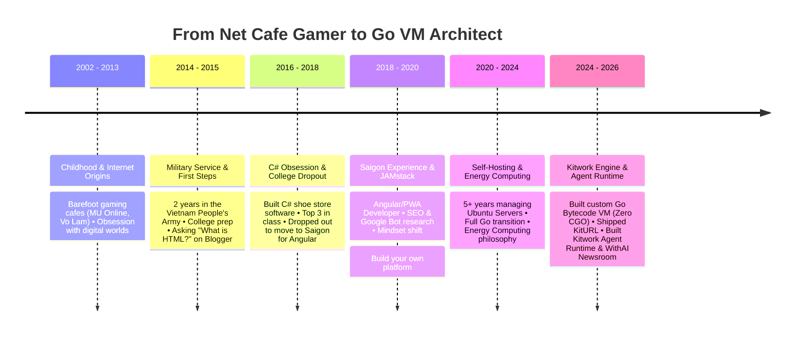

# Hi, I'm Huỳnh Nhân Quốc (Q) 👋

> **📍 Tam Ky ↔ Da Nang, Vietnam** | 🚀 **Indie Engineer** | 🧠 **Go VM Architect & Systems Developer**  
> *"I used to spend years writing code by hand; now I craft sovereign execution engines alongside Agentic AI."*

---

## 🌟 Overview

Hi there! I'm **Huỳnh Nhân Quốc** (often known as **Q**). I am an independent engineer (Indie Engineer), creator, and author of **[Kitwork Engine](https://kitwork.io/)** — a multi-tenant logic engine and custom bytecode VM runtime built entirely in Go.

My journey did not begin in a prestigious university lab or with high-profile startup funding. It started barefoot in internet cafes playing online games in 2002, standing in the ranks of the Vietnam People's Army for 2 years (2014–2015), dropping out of university while ranking in the top 3 of my class to pursue real-world engineering, and spending over 6 years mastering server infrastructure (self-hosting), energy computing, and virtual machine architecture.

---

## 📚 Life & Engineering Journey (2002 — 2026)

### 🎮 1. Childhood, Internet & Online Gaming (2002 – 2013)
In 2002, when the Internet first reached Vietnam, I was a young boy climbing fences and walking barefoot to local net cafes. 
- My childhood revolved around *MU Online*, *Yahoo Messenger*, *Võ Lâm Truyền Kỳ*, *Space Cowboy*, and *Perfect World*.
- In real life, I was an anonymous kid, but in the game, I was a relentless hero grinding through levels.
- That childhood—though filled with strict discipline—instilled in me a lifelong curiosity for computers and digital systems.

### 🪖 2. Military Service & First Engineering Steps (2014 – 2015)
- **2014**: Enlisted in the Vietnam People's Army for 2 years of mandatory military service. Serving my country remains one of my proudest early achievements.
- **February 2015**: Discharged and returned home to Tam Ky. I helped my family, earned my driver's license, prepared for university exams, and discovered Blogger.
- **September 2015**: Admitted to Quang Nam University majoring in IT. The very first question I searched online was: *"What is HTML?"*. I taught myself HTML, CSS, and JavaScript to customize Blogger themes.
- My class had 11 international students from Laos. Intrigued by their Vietnamese fluency, I taught myself conversational Lao to connect and share jokes with them.

### 💻 3. C# Obsession & The Choice to Drop Out (2016 – 2018)
- **Year 2 of University**: I fell in love with C#. Over 3 intense months, I built a shoe store management desktop application using WinForms, Hashtables for color indexing, and Code128 barcodes. That was when I truly grasped recursion and data structures.
- I leaped into the **Top 3 of my class**, scoring near-perfect grades in C# and SQL.
- I went on to explore WPF, MVVM, Entity Framework, Xamarin, Firebase Realtime Database, and Progressive Web Apps (PWA).
- **Early 2018**: Realizing university could not take me where I truly wanted to go, I dropped out—despite ranking **5th out of 46 students with an 8.16 GPA**—and moved to Saigon to work as a full-time Angular developer.

### 🚀 4. Saigon Engineering, JAMstack & Platform Mindset (2018 – 2020)
- Worked as an Angular developer in Saigon. Days spent shipping code, nights spent reading others' code to level up.
- **The SEO Awakening**: I noticed client sites I built ranked #1 on Google, but my personal sites performed poorly. I dove deep into Google Bot mechanics, Server-side Rendering (SSR), PWA, and JAMstack (Hugo, GatsbyJS).
- **The Paradigm Shift**: *"A framework is only as good as your understanding of it. I don't want to just learn other people's frameworks anymore—I want to build my own platform."*
- On April 19, 2019, I reflected on my youth: No mentors, no guides—just following my intuition and moving forward.

### ⚙️ 5. Self-Hosting, Go (Golang) & Energy Computing (2020 – 2024)
- Transitioned entirely to **Go (Golang)** for backend systems, drawn to its request speed, goroutine concurrency, and minimal syntax design.
- Spent over 5 years self-hosting on Ubuntu servers, taking full ownership of infrastructure rather than relying on costly third-party cloud services.
- Formulated **Energy Computing**: Treating every memory allocation, context switch, and syscall as a unit of energy with a real cost. Focused on zero-allocation patterns on hot execution paths.

### 🧠 6. Building Kitwork Engine & Agent Runtime (2024 – 2026)
Over the past year, I focused on designing and engineering **Kitwork Engine**:
- **Custom Stack-based Bytecode VM in Pure Go**: Built around the philosophy "One binary. Many isolated systems." Zero CGO dependencies, ~14MB binary size, near-instant startup time.
- **24-Byte Value System**: Memory-optimized NaN-boxed tagged union struct.
- **Deterministic Execution via JS Subset**: No `while` loops, no `try-catch`, arrow functions only, with opcode gas energy limits (`MaxEnergy`).
- **Filesystem Tree Routing**: Clean directory-based routing (`router.kitwork.js` & `page.kitwork.html`).
- **Production Dogfooding**:
  * **KitURL**: High-performance URL shortener built natively on Kitwork.
  * **Kitwork Agent Runtime**: Multi-tenant AI Agent execution environment with SQLite state persistence, Skill contracts, and **Human Approval Checkpoints**.
  * **WithAI Newsroom**: Autonomous news gathering, verification, and editing agent system for WithAI.vn.

---

## ⚙️ Core Projects

- ⚙️ **[Kitwork Engine](https://kitwork.io/)**: Sovereign multi-tenant Go logic engine & custom bytecode VM runtime.
- 🤖 **[Kitwork Agent Runtime](https://kitwork.io/agents)**: One binary, many isolated, durable AI agents with human approval checkpoints.
- 📰 **[WithAI.vn](https://withai.vn/)**: AI news platform powered by WithAI Newsroom Agents.
- 🔗 **[KitURL](https://kiturl.localhost)**: High-performance URL shortener running on Kitwork Engine.
- 🔎 **[seoer.ai](https://seoer.ai/)**: Generative Engine Optimization (GEO) & AI search specification.
- 🚀 **[theinpublic.com](https://theinpublic.com/)**: Build in Public & open startup knowledge hub.
- 🎧 **[lofiwithme.com](https://lofiwithme.com/)**: Ambient focus & lofi workspace.
- 🏠 **[huynhnhanquoc.com](https://huynhnhanquoc.com/)**: Personal portal, Substack writing & Digital Garden.

---

## 💡 Engineering & Personal Philosophy

> *"Some people work for money.*  
> *Some people work for passion.*  
> *I work for **HAPPINESS**."*

- **Clean Hands**: *"As long as these hands stay clean, I will take on any honest challenge."*
- **Relentless Craftsmanship**: Learning from scratch without mentors, willing to rebuild systems if it means mastering core technology.
- **Technological Sovereignty**: Writing custom VMs, managing raw servers, and crafting tools to retain independence in every choice.

---

## 📖 Digital Garden & Open Writing

All my research, reflection, and engineering notes are open-sourced in **[publics/huynhnhanquoc](https://github.com/huynhnhanquoc/huynhnhanquoc)**:

* 📄 **[65 Substack Articles (2020 – 2026)](blog/)**: Full archive of writings covering indie hacking, Go VM engineering, self-hosting, and personal philosophy.
* 📄 **[49 Kitwork Architecture Reports (kitwork/)](kitwork/)**: Deep technical reports on Bytecode VM design, Memory Allocation, Gas Accounting, DX, and Agent Runtime.
* 📄 **[Thinking & Concepts (concepts/ & thinking/)](concepts/)**: Architectural notes and system designs.

---

## 🌐 Connect with Me

- 📧 **Email**: [hi@huynhnhanquoc.com](mailto:hi@huynhnhanquoc.com)
- 🌐 **Website**: [huynhnhanquoc.com](https://huynhnhanquoc.com)
- 💻 **GitHub**: [@huynhnhanquoc](https://github.com/huynhnhanquoc)
- 🐦 **X (Twitter)**: [@huynhnhanquoc](https://x.com/huynhnhanquoc)
- 🧵 **Threads**: [@huynhnhanquoc](https://threads.com/@huynhnhanquoc)
- 📰 **Substack**: [huynhnhanquoc.substack.com](https://huynhnhanquoc.substack.com)
- 📺 **YouTube**: [@huynhnhanquoc](https://www.youtube.com/@huynhnhanquoc)

---

*Maintained by **Huỳnh Nhân Quốc** — Tam Ky / Da Nang, Vietnam.*
