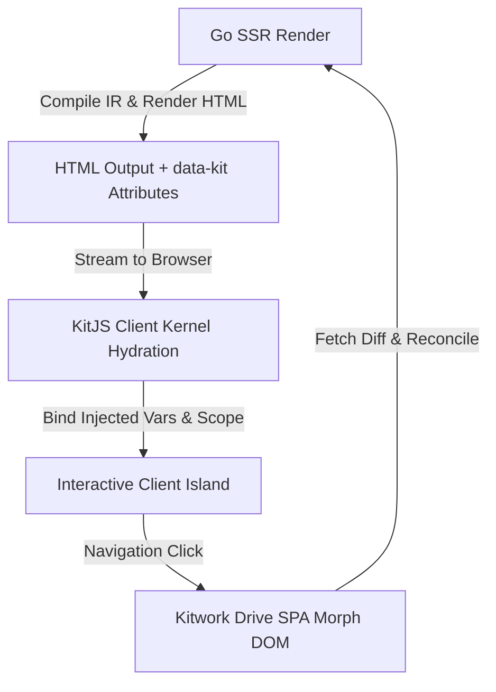

# 💡 Ideaship: Evolution of the KitJS Hydration & Prerender Engine

> **Historical design record:** native capability examples in this document predate the current
> `kit.<service>.<method>()` contract. `$app` is now an application component alias.

> **"Architectural design notes and ideaship dialogues detailing KitJS client hydration, DOM morphing, system variables, and native server-client bridge mechanics."**

---

## 📌 The Ideaship Spark

During the core design phase of Kitwork, a fundamental engineering challenge emerged: *How do we deliver lightning-fast Server-Side Rendered (SSR) HTML while preserving fluid, SPA-like client interactivity without importing heavy JavaScript frameworks?*

The Ideaship architectural dialogues led to KitJS V2's 4-tier hydration pipeline:

---

## ⚙️ Core Breakthroughs from the Ideaship Dialogues

### 1. Unified Expression State (`$` Scope) & Magic Variables
* Application state is scoped cleanly under the `$` page object.
* Every inline expression receives injected system variables: `$this` (directive owner), `$host` (scope container), `$event` (native DOM event), `$error` (error boundary context), `$refs` (component registry), and `$app` (native capability bridge).

### 2. 3-Group Property & Attribute Binding Contract
* Binding strategies are selected based on property metadata rather than a blanket rule:
  - **Reflected Boolean** (`disabled`, `required`): Mutates DOM Property + HTML Attribute (`toggleAttribute`).
  - **Live State Property** (`checked`, `value`): Mutates DOM Property only, preserving form reset defaults.
  - **Attribute-Only** (`data-kit-attr:aria-expanded`): Mutates HTML attribute.

### 3. List SSR Adoption (`data-kit-for`, `data-kit-item`, `data-kit-key`)
* HTML Source uses `data-kit-for="item, index of items"`.
* SSR Output emits materialized DOM items with `data-kit-item="<loop-id>"` inside HTML comment markers (`<!--kit-for:start id=items-1-->`). Prototypes are cloned safely from Compiled Server IR Blueprints rather than live hydrated DOM nodes.

### 4. Smart DOM Morphing (Kitwork Drive)
* Instead of destructive `innerHTML` replacements during page transitions, Kitwork Drive executes a lightweight tree-reconciliation algorithm that preserves comment markers, updates mutated nodes in-place, and preserves input focus and animation state.

### 5. Server-Client Native Bridge (`$app` Capability Bridge)
* Eliminates boilerplate REST/GraphQL API controllers.
* Facilitates automated state synchronization and hardware access (`$app.camera()`, `$app.qrcode()`, `$app.clipboard()`) between the Go Host runtime and the browser client kernel.
