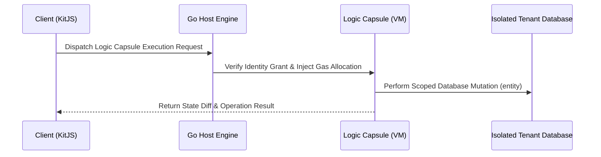

# 🚀 RFC: 3-Tier Architecture & Secure Logic Capsules

> **"Specification proposal for Logic Capsules — Encapsulated, client-triggered logic executed safely inside the Go host VM under explicit Identity Grants and Gas metering."**

---

## 🎯 Problem Statement

Traditional web applications enforce a rigid wall between Frontend and Backend. To execute simple business mutations (e.g., awarding reward points, updating order status, processing state transitions), developers must:

1. Handcraft dedicated REST/GraphQL API controllers on the backend.
2. Implement redundant authentication and authorization checks.
3. Write client-side fetch wrappers and error-handling boilerplate.

---

## 💡 The 3-Tier Architecture & Logic Capsules

Kitwork introduces a unified 3-Tier Execution Model:

1. **Tier 1 (SSR Shell):** High-speed HTML view templates and partials rendered directly from disk (Zero-VM).
2. **Tier 2 (KitJS Hydrate):** Declarative client interactivity using `data-kit-*` data attributes.
3. **Tier 3 (Logic Capsule):** Self-contained logic blocks dispatched by the client but executed **directly inside the Host Go VM** under strict Gas Metering and Identity Grants.

---

## 🛡️ Security & Scalability Guarantees

* **Gas Limit Metering:** Prevents runaway or malicious loops from consuming host CPU cycles.
* **Identity-Scoped Access (`entity()`):** Database mutations are automatically bound to the authenticated tenant's security scope.
* **Cluster Replication:** Logic Capsules can be distributed and executed across multi-node clusters without state divergence.
