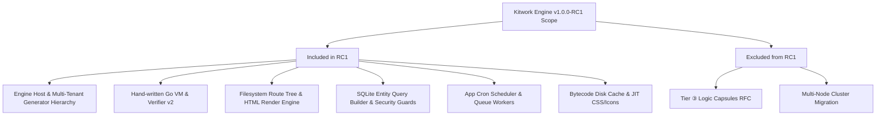

# Kitwork Engine — Release Candidate Plan (v1.0.0-RC1)

This document establishes the official execution plan, scope boundaries, mandatory blocker requirements, testing matrix, and final readiness verdict for **Kitwork Engine v1.0.0-RC1**.

---

## 1. Release Candidate Scope & Feature Boundary

### Features Included in RC1
- Hand-written Go VM interpreter & pre-publication bytecode verifier (`BytecodeVersion == 2`).
- Filesystem-based router tree (`router.kitwork.js` & `page.kitwork.html`).
- HTML view render plan engine with nested layout bubbling (`_layout_.kitwork.html`).
- Parameterized SQLite query builder with mandatory mutation `.where()` guards.
- Per-tenant `.env` isolation and proxy coercion.
- App-owned Cron scheduler and background queue worker.
- JIT CSS utility & Tabler icon mask generator.
- Preflight pre-activation validation tool (`go run . check`).

### Features Excluded from RC1 (Deferred to v1.1 / v2.0)
- Tier ③ untrusted client-sent logic capsules (retains RFC status in `ARCHITECTURE.md`).
- Multi-node cluster placement and cross-server tenant migration.

---

## 2. Mandatory Blocker Tasks Before RC1 Release

The following 4 tasks are strict release blockers for RC1 publication:

| Task ID | Blocker Description | Target File | Verification Method |
|---|---|---|---|
| **BLK-01** | Fix lock inversion deadlock on `Engine.Close()` ([KIT-B02](file:///d:/project/kitwork/engine/docs/reports/stabilization-backlog.md)). | [engine/core/engine.go](file:///d:/project/kitwork/engine/core/engine.go) | `go test -race ./core` passes under concurrent request drains. |
| **BLK-02** | Fix map key cast method shadowing in `value.Invoke` ([KIT-B03](file:///d:/project/kitwork/engine/docs/reports/stabilization-backlog.md)). | [engine/value/methods.go](file:///d:/project/kitwork/engine/value/methods.go) | `go test ./value` passes with map key precedence assertions. |
| **BLK-03** | Fix `FileCache` key calculation for indirect relative imports ([KIT-B04](file:///d:/project/kitwork/engine/docs/reports/stabilization-backlog.md)). | [engine/compiler/cache.go](file:///d:/project/kitwork/engine/compiler/cache.go) | `go test ./compiler` passes cache invalidation test. |
| **BLK-04** | Reconcile historical `ARCHITECTURE.md` documentation with production routing tree. | [engine/docs/ARCHITECTURE.md](file:///d:/project/kitwork/engine/docs/ARCHITECTURE.md) | Header disclaimer banner added and production tree routing documented. |

---

## 3. Platform Testing & Release Criteria

### Supported Target Platforms
- **Windows**: `windows/amd64`
- **Linux**: `linux/amd64`, `linux/arm64`
- **macOS**: `darwin/arm64` (Apple Silicon), `darwin/amd64` (Intel)

### Release Criteria (All Must Pass)
1. Clean cross-compilation builds across all 5 target platform pairs.
2. `go test ./...` and `go test -race ./...` pass with **zero failures and zero data races**.
3. `go test ./work -run TestHandlerCorpusAllocationBudgets` passes with zero allocation on hot HTTP request paths.
4. `go run . check` preflight validator runs clean on all discovered route trees.
5. Fuzz targets (`FuzzCompileVerifyExecute`, `FuzzVMDeterminism`) pass 10-minute continuous fuzzing runs.

---

## 4. Official Readiness Verdict

> [!IMPORTANT]
> **VERDICT: Kitwork Engine is NEAR READY for v1.0.0-RC1, but has 4 mandatory blocker tasks remaining.**

### Justification:
The underlying VM architecture, pre-publication bytecode verifier, filesystem route tree engine, and memory retention controls are solid, deterministic, and well-tested. However, before publishing a public v1.0.0-RC1 binary release, the team must execute **Stabilization Sprint 1** to resolve the 4 identified blocker tasks (lock inversion fix, cast method shadowing fix, cache key import fix, and documentation reconciliation).

Once Sprint 1 is complete, Kitwork Engine will be 100% ready for v1.0.0-RC1 publication!
